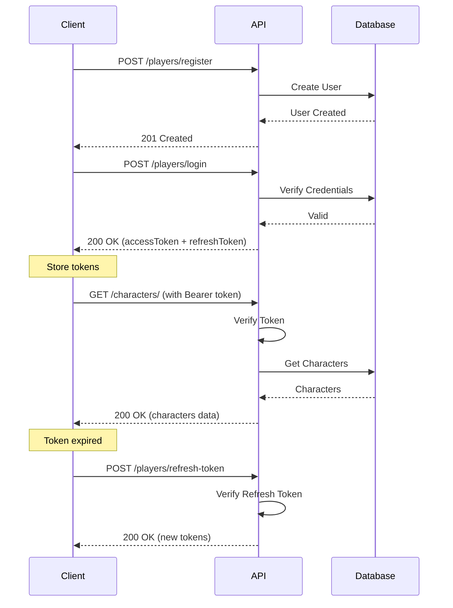
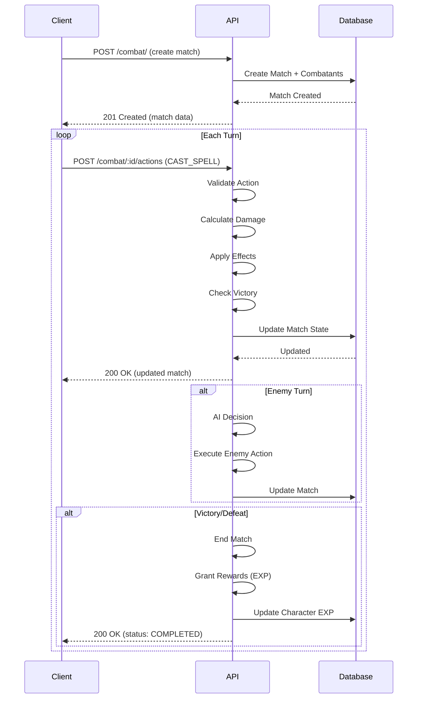

# 📡 API Endpoints Reference

**Complete API Documentation**  
**Date:** November 1, 2025  
**Base URL:** `http://localhost:8080/api/v1`  
**Authentication:** Bearer Token (JWT)

---

## 📑 Table of Contents

1. [Authentication & Player Management](#1-authentication--player-management)
2. [Character Management](#2-character-management)
3. [Deck Management](#3-deck-management)
4. [Combat System](#4-combat-system)
5. [Game Data](#5-game-data)
6. [PVE (Story Mode)](#6-pve-story-mode)
7. [Enemy Information](#7-enemy-information)
8. [Fusion (Crafting)](#8-fusion-crafting)

---

## 1. Authentication & Player Management

### 1.1 Register New Account

**สร้างบัญชีผู้เล่นใหม่**

```http
POST /api/v1/players/register
Content-Type: application/json
```

**Request Body:**

```json
{
   "username": "player123",
   "email": "player@example.com",
   "password": "securepass123"
}
```

**Validation Rules:**

-  `username`: minimum 4 characters, required
-  `email`: valid email format, required
-  `password`: minimum 8 characters, required

**Response (201 Created):**

```json
{
   "success": true,
   "message": "Registration successful",
   "data": {
      "id": 1,
      "username": "player123",
      "email": "player@example.com",
      "created_at": "2025-11-01T10:00:00Z"
   }
}
```

**Error Responses:**

-  `400` - Validation error (username too short, invalid email, etc.)
-  `409` - Username already exists

---

### 1.2 Login

**เข้าสู่ระบบและรับ Access Token**

```http
POST /api/v1/players/login
Content-Type: application/json
```

**Request Body:**

```json
{
   "username": "player123",
   "password": "securepass123"
}
```

**Response (200 OK):**

```json
{
   "success": true,
   "message": "Login successful",
   "data": {
      "accessToken": "eyJhbGciOiJIUzI1NiIs...",
      "refreshToken": "eyJhbGciOiJIUzI1NiIs..."
   }
}
```

**Error Responses:**

-  `401` - Invalid credentials
-  `404` - User not found

**⚠️ Note:** เก็บ `accessToken` ไว้ใช้ใน Header: `Authorization: Bearer <accessToken>`

---

### 1.3 Refresh Token

**ขอ Access Token ใหม่เมื่อหมดอายุ**

```http
POST /api/v1/players/refresh-token
Content-Type: application/json
```

**Request Body:**

```json
{
   "refreshToken": "eyJhbGciOiJIUzI1NiIs..."
}
```

**Response (200 OK):**

```json
{
   "success": true,
   "message": "Token refreshed successfully",
   "data": {
      "accessToken": "eyJhbGciOiJIUzI1NiIs...",
      "refreshToken": "eyJhbGciOiJIUzI1NiIs..."
   }
}
```

**Error Responses:**

-  `401` - Invalid or expired refresh token

---

### 1.4 Get Player Profile

**ดูข้อมูลโปรไฟล์ผู้เล่น**

```http
GET /api/v1/players/me
Authorization: Bearer <accessToken>
```

**Response (200 OK):**

```json
{
   "success": true,
   "message": "Profile retrieved successfully",
   "data": {
      "id": 1,
      "username": "player123",
      "email": "player@example.com",
      "created_at": "2025-11-01T10:00:00Z",
      "updated_at": "2025-11-01T10:00:00Z"
   }
}
```

**Error Responses:**

-  `401` - Unauthorized (invalid or missing token)

---

## 2. Character Management

### 2.1 Create Character

**สร้างตัวละครใหม่**

```http
POST /api/v1/characters/
Authorization: Bearer <accessToken>
Content-Type: application/json
```

**Request Body:**

```json
{
   "name": "FireMage",
   "gender": "MALE",
   "elementId": 1,
   "masteryId": 1
}
```

**Field Details:**

-  `name`: ชื่อตัวละคร (minimum 3 characters, unique)
-  `gender`: `"MALE"` หรือ `"FEMALE"` (cosmetic only, ไม่มีผลต่อ stats)
-  `elementId`: Primary Element
   -  `1` = S (Solidity) - โฟกัสทาง HP/Defense
   -  `2` = L (Liquidity) - โฟกัสทาง MP/Healing
   -  `3` = G (Gas) - โฟกัสทาง Initiative/Speed
   -  `4` = P (Plasma) - โฟกัสทาง Duration/DoT
-  `masteryId`: Primary Mastery (1-4)
   -  `1` = Creation
   -  `2` = Destruction
   -  `3` = Restoration
   -  `4` = Transmutation

**Response (201 Created):**

```json
{
   "success": true,
   "message": "Character created successfully",
   "data": {
      "id": 1,
      "player_id": 1,
      "character_name": "FireMage",
      "gender": "MALE",
      "primary_element_id": 1,
      "level": 1,
      "exp": 0,
      "talent_s": 93,
      "talent_l": 3,
      "talent_g": 3,
      "talent_p": 3,
      "unallocated_talent_points": 0,
      "current_hp": 1023,
      "current_mp": 330,
      "masteries": [
         {
            "mastery_id": 1,
            "level": 1,
            "mxp": 0
         },
         {
            "mastery_id": 2,
            "level": 1,
            "mxp": 0
         },
         {
            "mastery_id": 3,
            "level": 1,
            "mxp": 0
         },
         {
            "mastery_id": 4,
            "level": 1,
            "mxp": 0
         }
      ],
      "tutorial": {
         "current_step": 0,
         "is_completed": false
      },
      "created_at": "2025-11-01T10:05:00Z"
   }
}
```

**Talent Calculation:**

```
Base Allocation: 3 points per talent
Primary Element Bonus: +90 points

Example (Primary Element = S):
- TalentS = 3 + 90 = 93
- TalentL = 3
- TalentG = 3
- TalentP = 3
Total: 102 points
```

**Stats Calculation:**

```
MaxHP = STAT_HP_BASE(100) + (TalentS × STAT_HP_PER_TALENT_S(10))
MaxMP = STAT_MP_BASE(100) + (TalentL × STAT_MP_PER_TALENT_L(25))

Example (TalentS=93, TalentL=3):
- MaxHP = 100 + (93 × 10) = 1,030
- MaxMP = 100 + (3 × 25) = 175
```

**Error Responses:**

-  `400` - Validation error (name too short, invalid element/mastery ID)
-  `409` - Character name already exists

---

### 2.2 List All Characters

**ดูรายการตัวละครทั้งหมดของผู้เล่น**

```http
GET /api/v1/characters/
Authorization: Bearer <accessToken>
```

**Response (200 OK):**

```json
{
   "success": true,
   "message": "Characters retrieved successfully",
   "data": [
      {
         "id": 1,
         "character_name": "FireMage",
         "gender": "MALE",
         "primary_element_id": 1,
         "level": 5,
         "exp": 250,
         "current_hp": 1023,
         "current_mp": 330,
         "created_at": "2025-11-01T10:05:00Z"
      },
      {
         "id": 2,
         "character_name": "WaterHealer",
         "gender": "FEMALE",
         "primary_element_id": 2,
         "level": 3,
         "exp": 100,
         "current_hp": 730,
         "current_mp": 2480,
         "created_at": "2025-11-01T11:00:00Z"
      }
   ]
}
```

---

### 2.3 Get Character Details

**ดูข้อมูลละเอียดของตัวละคร**

```http
GET /api/v1/characters/:id
Authorization: Bearer <accessToken>
```

**Path Parameters:**

-  `:id` - Character ID

**Response (200 OK):**

```json
{
   "success": true,
   "message": "Character retrieved successfully",
   "data": {
      "id": 1,
      "player_id": 1,
      "character_name": "FireMage",
      "gender": "MALE",
      "primary_element_id": 1,
      "level": 5,
      "exp": 250,
      "talent_s": 93,
      "talent_l": 3,
      "talent_g": 3,
      "talent_p": 3,
      "unallocated_talent_points": 0,
      "current_hp": 1023,
      "current_mp": 330,
      "masteries": [
         {
            "mastery_id": 1,
            "level": 3,
            "mxp": 50
         },
         {
            "mastery_id": 2,
            "level": 5,
            "mxp": 120
         },
         {
            "mastery_id": 3,
            "level": 1,
            "mxp": 0
         },
         {
            "mastery_id": 4,
            "level": 2,
            "mxp": 30
         }
      ],
      "tutorial": {
         "current_step": 5,
         "is_completed": true
      },
      "created_at": "2025-11-01T10:05:00Z",
      "updated_at": "2025-11-01T15:30:00Z"
   }
}
```

**Error Responses:**

-  `403` - Not the character owner
-  `404` - Character not found

---

### 2.4 Delete Character

**ลบตัวละคร**

```http
DELETE /api/v1/characters/:id
Authorization: Bearer <accessToken>
```

**Path Parameters:**

-  `:id` - Character ID

**Response (200 OK):**

```json
{
   "success": true,
   "message": "Character deleted successfully",
   "data": null
}
```

**Error Responses:**

-  `403` - Not the character owner
-  `404` - Character not found

---

### 2.5 Get Character Inventory

**ดูคลังไอเทม/การ์ดของตัวละคร**

```http
GET /api/v1/characters/:id/inventory
Authorization: Bearer <accessToken>
```

**Response (200 OK):**

```json
{
   "success": true,
   "message": "Inventory retrieved successfully",
   "data": {
      "characterId": 1,
      "currentMp": 330,
      "inventory": [
         {
            "id": 1,
            "character_id": 1,
            "element_id": 13,
            "quantity": 5,
            "element": {
               "id": 13,
               "element_name": "Ember (T2)",
               "tier": 2
            }
         },
         {
            "id": 2,
            "character_id": 1,
            "element_id": 21,
            "quantity": 2,
            "element": {
               "id": 21,
               "element_name": "Inferno (T3)",
               "tier": 3
            }
         }
      ]
   }
}
```

---

### 2.6 Advance Tutorial Step

**ทำ Tutorial ไปขั้นตอนถัดไป**

```http
POST /api/v1/characters/:id/tutorial/advance
Authorization: Bearer <accessToken>
```

**Response (200 OK):**

```json
{
   "success": true,
   "message": "Tutorial step advanced",
   "data": {
      "id": 1,
      "character_name": "FireMage",
      "tutorial": {
         "current_step": 2,
         "is_completed": false
      }
   }
}
```

---

### 2.7 Skip Tutorial

**ข้าม Tutorial ทั้งหมด**

```http
POST /api/v1/characters/:id/tutorial/skip
Authorization: Bearer <accessToken>
```

**Response (200 OK):**

```json
{
   "success": true,
   "message": "Tutorial skipped",
   "data": {
      "id": 1,
      "character_name": "FireMage",
      "tutorial": {
         "current_step": 999,
         "is_completed": true
      }
   }
}
```

---

## 3. Deck Management

### 3.1 Create Deck

**สร้างสำรับการ์ด (Deck) ใหม่**

```http
POST /api/v1/decks/
Authorization: Bearer <accessToken>
Content-Type: application/json
```

**Request Body:**

```json
{
   "character_id": 1,
   "deck_name": "Fire & Lightning Combo",
   "slots": [
      { "slot_num": 1, "element_id": 5 },
      { "slot_num": 2, "element_id": 6 },
      { "slot_num": 3, "element_id": 7 },
      { "slot_num": 4, "element_id": 8 },
      { "slot_num": 5, "element_id": 9 },
      { "slot_num": 6, "element_id": 10 },
      { "slot_num": 7, "element_id": 11 },
      { "slot_num": 8, "element_id": 12 }
   ]
}
```

**Field Details:**

-  `character_id`: ต้องเป็นตัวละครของผู้เล่นที่ login
-  `deck_name`: ชื่อสำรับ (required)
-  `slots`: Array ของการ์ด 1-8 ใบ
   -  `slot_num`: ตำแหน่งช่อง (1-8)
   -  `element_id`: ID ของธาตุ (ต้อง >= 5, T1 elements ขึ้นไป)

**Element ID Reference:**

```
Basic Elements (T1):
5-12 = Fire, Water, Wind, Earth, Lightning, Ice, Light, Dark

Tier 2 Elements (T2):
13-20 = Ember, Steam, Breeze, Stone, Spark, Frost, Glow, Shadow

Tier 3+ Elements:
21+ = Advanced fused elements
```

**Response (201 Created):**

```json
{
   "success": true,
   "message": "Deck created successfully",
   "data": {
      "id": 1,
      "character_id": 1,
      "deck_name": "Fire & Lightning Combo",
      "slots": [
         {
            "id": 1,
            "deck_id": 1,
            "slot_num": 1,
            "element_id": 5,
            "element": {
               "id": 5,
               "element_name": "Fire",
               "tier": 1
            }
         },
         {
            "id": 2,
            "deck_id": 1,
            "slot_num": 2,
            "element_id": 6,
            "element": {
               "id": 6,
               "element_name": "Water",
               "tier": 1
            }
         }
         // ... slots 3-8
      ],
      "created_at": "2025-11-01T10:30:00Z"
   }
}
```

**Error Responses:**

-  `400` - Validation error (invalid slot_num, element_id < 5)
-  `403` - Character doesn't belong to player
-  `404` - Character not found

---

### 3.2 Get All Decks

**ดูรายการ Deck ทั้งหมดของตัวละคร**

```http
GET /api/v1/decks/?character_id=:character_id
Authorization: Bearer <accessToken>
```

**Query Parameters:**

-  `character_id`: Character ID (required)

**Response (200 OK):**

```json
{
   "success": true,
   "message": "Decks retrieved successfully",
   "data": [
      {
         "id": 1,
         "character_id": 1,
         "deck_name": "Fire & Lightning Combo",
         "slots": [
            {
               "slot_num": 1,
               "element_id": 5,
               "element": {
                  "element_name": "Fire",
                  "tier": 1
               }
            }
            // ... more slots
         ],
         "created_at": "2025-11-01T10:30:00Z"
      },
      {
         "id": 2,
         "character_id": 1,
         "deck_name": "Pure Water Healing",
         "slots": [
            // ... slots
         ],
         "created_at": "2025-11-01T11:00:00Z"
      }
   ]
}
```

---

### 3.3 Update Deck

**แก้ไข Deck**

```http
PUT /api/v1/decks/:id
Authorization: Bearer <accessToken>
Content-Type: application/json
```

**Path Parameters:**

-  `:id` - Deck ID

**Request Body:**

```json
{
   "deck_name": "Updated Deck Name",
   "slots": [
      { "slot_num": 1, "element_id": 13 },
      { "slot_num": 2, "element_id": 14 },
      { "slot_num": 3, "element_id": 15 },
      { "slot_num": 4, "element_id": 16 },
      { "slot_num": 5, "element_id": 17 },
      { "slot_num": 6, "element_id": 18 },
      { "slot_num": 7, "element_id": 19 },
      { "slot_num": 8, "element_id": 20 }
   ]
}
```

**Response (200 OK):**

```json
{
   "success": true,
   "message": "Deck updated successfully",
   "data": {
      "id": 1,
      "deck_name": "Updated Deck Name",
      "slots": [
         // ... updated slots
      ]
   }
}
```

**Error Responses:**

-  `403` - Not the deck owner
-  `404` - Deck not found

---

### 3.4 Delete Deck

**ลบ Deck**

```http
DELETE /api/v1/decks/:id
Authorization: Bearer <accessToken>
```

**Path Parameters:**

-  `:id` - Deck ID

**Response (200 OK):**

```json
{
   "success": true,
   "message": "Deck deleted successfully",
   "data": null
}
```

---

## 4. Combat System

### 4.1 Create Match

**สร้างห้องต่อสู้ใหม่**

```http
POST /api/v1/combat/
Authorization: Bearer <accessToken>
Content-Type: application/json
```

#### **4.1.1 TRAINING Mode (โหมดฝึกซ้อม)**

เลือกศัตรูเองได้ ไม่มีจำกัด

**Request Body:**

```json
{
   "character_id": 1,
   "match_type": "TRAINING",
   "deck_id": 1,
   "training_enemies": [{ "enemy_id": 1 }, { "enemy_id": 2 }]
}
```

#### **4.1.2 STORY Mode (โหมดเนื้อเรื่อง)** ⚠️ Not Fully Implemented

ศัตรูโหลดจากด่านที่กำหนด

**Request Body:**

```json
{
   "character_id": 1,
   "match_type": "STORY",
   "deck_id": 1,
   "stage_id": 1
}
```

#### **4.1.3 PVP Mode (ต่อสู้ผู้เล่น)** ⚠️ Not Fully Implemented

ต่อสู้กับตัวละครของผู้เล่นอื่น

**Request Body:**

```json
{
   "character_id": 1,
   "match_type": "PVP",
   "deck_id": 1,
   "opponent_id": 2
}
```

**Field Details:**

-  `character_id`: ตัวละครที่จะใช้ต่อสู้
-  `match_type`: `"TRAINING"`, `"STORY"`, หรือ `"PVP"`
-  `deck_id`: Deck ที่จะใช้ (optional ถ้าส่ง `deck` array มาแทน)
-  `deck`: Array of deck slots (optional, ใช้แทน `deck_id`)
-  `training_enemies`: Array of enemy IDs (required สำหรับ TRAINING)
-  `stage_id`: Stage ID (required สำหรับ STORY)
-  `opponent_id`: Character ID ของฝ่ายตรงข้าม (required สำหรับ PVP)

**Response (201 Created):**

```json
{
   "success": true,
   "message": "Match created successfully",
   "data": {
      "id": "01932f5d-8e9f-7890-abcd-ef1234567890",
      "match_type": "TRAINING",
      "status": "IN_PROGRESS",
      "current_turn": 1,
      "current_phase": "START",
      "active_combatant_id": "01932f5d-aaaa-aaaa-aaaa-aaaaaaaaaaaa",
      "combatants": [
         {
            "id": "01932f5d-aaaa-aaaa-aaaa-aaaaaaaaaaaa",
            "character_id": 1,
            "enemy_id": null,
            "initiative": 330,
            "current_hp": 1023,
            "current_mp": 330,
            "current_ap": 0,
            "active_effects": [],
            "deck": [
               {
                  "id": "01932f5d-dddd-dddd-dddd-dddddddddddd",
                  "combatant_id": "01932f5d-aaaa-aaaa-aaaa-aaaaaaaaaaaa",
                  "element_id": 5,
                  "is_consumed": false
               }
               // ... 7 more deck slots
            ]
         },
         {
            "id": "01932f5d-bbbb-bbbb-bbbb-bbbbbbbbbbbb",
            "character_id": null,
            "enemy_id": 1,
            "initiative": 280,
            "current_hp": 800,
            "current_mp": 9999,
            "current_ap": 0,
            "active_effects": [],
            "deck": []
         }
      ],
      "combat_logs": [],
      "created_at": "2025-11-01T10:15:00Z",
      "updated_at": "2025-11-01T10:15:00Z"
   }
}
```

**Match Phases:**

-  `START` - เริ่มเทิร์น
-  `ACTION` - ทำ action (cast spell, end turn)
-  `RESOLVE` - คำนวณผล
-  `END` - จบเทิร์น

**Error Responses:**

-  `403` - Character doesn't belong to player
-  `404` - Character/Deck/Enemy not found
-  `409` - Character already has an active match
-  `501` - STORY/PVP mode not implemented yet

---

### 4.2 Perform Action

**ทำการกระทำในการต่อสู้**

```http
POST /api/v1/combat/:match_id/actions
Authorization: Bearer <accessToken>
Content-Type: application/json
```

**Path Parameters:**

-  `:match_id` - Match UUID

#### **4.2.1 End Turn (จบเทิร์น)**

**Request Body:**

```json
{
   "action_type": "END_TURN"
}
```

#### **4.2.2 Cast Spell (ร้ายเวท)**

**Request Body:**

```json
{
   "action_type": "CAST_SPELL",
   "cast_mode": "INSTANT",
   "spell_id": 101,
   "target_id": "01932f5d-bbbb-bbbb-bbbb-bbbbbbbbbbbb"
}
```

**Field Details:**

-  `action_type`: `"END_TURN"` หรือ `"CAST_SPELL"`
-  `cast_mode`: (required สำหรับ CAST_SPELL)
   -  `"INSTANT"` - ร้ายทันที (1.0x damage, 1.0x MP cost)
   -  `"CHARGE"` - ชาร์จ (1.5x damage, 1.5x MP cost)
   -  `"OVERCHARGE"` - โอเวอร์ชาร์จ (2.0x damage, 2.0x MP cost)
-  `spell_id`: ID ของเวทที่ต้องการใช้
-  `target_id`: Combatant UUID ของเป้าหมาย

**Response (200 OK):**

```json
{
   "success": true,
   "message": "Action performed successfully",
   "data": {
      "updatedMatch": {
         "id": "01932f5d-8e9f-7890-abcd-ef1234567890",
         "status": "IN_PROGRESS",
         "current_turn": 2,
         "current_phase": "ACTION",
         "active_combatant_id": "01932f5d-bbbb-bbbb-bbbb-bbbbbbbbbbbb",
         "combatants": [
            {
               "id": "01932f5d-aaaa-aaaa-aaaa-aaaaaaaaaaaa",
               "current_hp": 1023,
               "current_mp": 310,
               "current_ap": 0,
               "deck": [
                  {
                     "element_id": 5,
                     "is_consumed": true
                  }
                  // ... remaining deck
               ]
            },
            {
               "id": "01932f5d-bbbb-bbbb-bbbb-bbbbbbbbbbbb",
               "current_hp": 650,
               "current_mp": 9999,
               "current_ap": 0
            }
         ],
         "combat_logs": [
            {
               "turn": 1,
               "phase": "ACTION",
               "combatant_id": "01932f5d-aaaa-aaaa-aaaa-aaaaaaaaaaaa",
               "action_type": "CAST_SPELL",
               "spell_id": 101,
               "target_id": "01932f5d-bbbb-bbbb-bbbb-bbbbbbbbbbbb",
               "cast_mode": "INSTANT",
               "damage_dealt": 150,
               "mp_consumed": 20,
               "deck_consumed": [5],
               "timestamp": "2025-11-01T10:16:00Z"
            }
         ]
      },
      "performedAction": {
         "action_type": "CAST_SPELL",
         "cast_mode": "INSTANT",
         "spell_id": 101,
         "target_id": "01932f5d-bbbb-bbbb-bbbb-bbbbbbbbbbbb"
      }
   }
}
```

**Match Victory Detection:**

ถ้าศัตรูทุกตัวตาย (HP ≤ 0):

```json
{
   "updatedMatch": {
      "status": "COMPLETED",
      "result": "VICTORY",
      "winner_id": "01932f5d-aaaa-aaaa-aaaa-aaaaaaaaaaaa",
      "ended_at": "2025-11-01T10:20:00Z"
   }
}
```

ถ้าผู้เล่นตาย (HP ≤ 0):

```json
{
   "updatedMatch": {
      "status": "COMPLETED",
      "result": "DEFEAT",
      "winner_id": null,
      "ended_at": "2025-11-01T10:20:00Z"
   }
}
```

**Error Responses:**

-  `400` - Invalid action (wrong phase, insufficient MP, etc.)
-  `403` - Not your turn
-  `404` - Match/Spell/Target not found

---

### 4.3 Resolve Spell

**ดูเวทที่จะได้จากการใช้ธาตุ + ศาสตร์**

```http
GET /api/v1/combat/resolve-spell?element_id=5&mastery_id=1&caster_element_id=1
Authorization: Bearer <accessToken>
```

**Query Parameters:**

-  `element_id`: ID ของธาตุที่ต้องการใช้ (required)
-  `mastery_id`: ID ของศาสตร์ที่ต้องการใช้ (required)
-  `caster_element_id`: ธาตุหลักของผู้ร้าย (required)

**Response (200 OK):**

```json
{
   "success": true,
   "message": "Spell resolved successfully",
   "data": {
      "spell": {
         "id": 101,
         "spell_name": "Fireball",
         "element_id": 5,
         "mastery_id": 2,
         "base_damage": 100,
         "base_mp_cost": 20,
         "effects": [
            {
               "effect_id": 1001,
               "effect_name": "Direct Damage",
               "base_value": 100
            }
         ]
      },
      "element_requested": 5,
      "mastery_requested": 1,
      "caster_element_used": 1
   }
}
```

**Spell Resolution Logic:**

1. หาเวทที่ตรงกับ `element_id` + `mastery_id` + `caster_element_id`
2. ถ้าไม่เจอ → ลอง fallback โดยใช้ mastery อื่น
3. ถ้ายังไม่เจอ → ส่ง error

---

## 5. Game Data

### 5.1 Get All Elements

**ดูรายการธาตุทั้งหมด**

```http
GET /api/v1/game-data/elements
Authorization: Bearer <accessToken>
```

**Response (200 OK):**

```json
{
   "success": true,
   "message": "Elements retrieved successfully",
   "data": [
      {
         "id": 1,
         "element_name": "S (Solidity)",
         "tier": 0,
         "is_primary": true
      },
      {
         "id": 5,
         "element_name": "Fire",
         "tier": 1,
         "is_primary": false
      },
      {
         "id": 13,
         "element_name": "Ember",
         "tier": 2,
         "is_primary": false
      }
      // ... more elements
   ]
}
```

**Element Tiers:**

-  **Tier 0**: Primary Elements (S, L, G, P) - ไม่สามารถใช้ใน deck ได้
-  **Tier 1**: Basic Elements (Fire, Water, Wind, etc.) - เริ่มต้น
-  **Tier 2+**: Fused Elements - ได้จากการ Fusion

---

### 5.2 Get All Spells

**ดูรายการเวทมนต์ทั้งหมด**

```http
GET /api/v1/game-data/spells
Authorization: Bearer <accessToken>
```

**Response (200 OK):**

```json
{
   "success": true,
   "message": "Spells retrieved successfully",
   "data": [
      {
         "id": 101,
         "spell_name": "Fireball",
         "element_id": 5,
         "mastery_id": 2,
         "caster_element_id": 1,
         "base_damage": 100,
         "base_mp_cost": 20,
         "effects": [
            {
               "effect_id": 1001,
               "effect_name": "Direct Damage",
               "base_value": 100
            }
         ]
      }
      // ... more spells
   ]
}
```

---

### 5.3 Get All Effects

**ดูรายการ Effect ทั้งหมด**

```http
GET /api/v1/game-data/effects
Authorization: Bearer <accessToken>
```

**Response (200 OK):**

```json
{
   "success": true,
   "message": "Effects retrieved successfully",
   "data": [
      {
         "id": 1001,
         "effect_name": "Direct Damage",
         "effect_type": "DAMAGE",
         "description": "Deals immediate damage to target"
      },
      {
         "id": 1002,
         "effect_name": "Damage Over Time",
         "effect_type": "DOT",
         "description": "Deals damage each turn"
      }
      // ... more effects
   ]
}
```

**Effect Types:**

-  `DAMAGE` - ดาเมจทันที
-  `DOT` - Damage Over Time
-  `HEAL` - ฟื้นฟู HP
-  `HOT` - Heal Over Time
-  `BUFF` - เพิ่ม stat
-  `DEBUFF` - ลด stat
-  `SHIELD` - โล่ป้องกัน
-  `SYNERGY_BUFF` - Buff พิเศษ

---

### 5.4 Get All Masteries

**ดูรายการศาสตร์ทั้งหมด**

```http
GET /api/v1/game-data/masteries
Authorization: Bearer <accessToken>
```

**Response (200 OK):**

```json
{
   "success": true,
   "message": "Masteries retrieved successfully",
   "data": [
      {
         "id": 1,
         "mastery_name": "Creation",
         "description": "Focus on summoning and buffs"
      },
      {
         "id": 2,
         "mastery_name": "Destruction",
         "description": "Focus on dealing damage"
      },
      {
         "id": 3,
         "mastery_name": "Restoration",
         "description": "Focus on healing and support"
      },
      {
         "id": 4,
         "mastery_name": "Transmutation",
         "description": "Focus on transformation and debuffs"
      }
   ]
}
```

---

## 6. PVE (Story Mode)

### 6.1 Get All Realms

**ดูรายการโลก/ภูมิภาคทั้งหมด**

```http
GET /api/v1/pve/realms
Authorization: Bearer <accessToken>
```

**Response (200 OK):**

```json
{
   "success": true,
   "message": "Realms retrieved successfully",
   "data": [
      {
         "id": 1,
         "realm_name": "Fire Realm",
         "description": "A world engulfed in eternal flames",
         "stages": [
            {
               "id": 1,
               "stage_name": "Ember Plains",
               "difficulty": 1,
               "enemies": [
                  {
                     "enemy_id": 1,
                     "position": 1
                  }
               ]
            }
            // ... more stages
         ]
      }
      // ... more realms
   ]
}
```

---

## 7. Enemy Information

### 7.1 Get All Enemies

**ดูรายการศัตรูทั้งหมด**

```http
GET /api/v1/enemies/
Authorization: Bearer <accessToken>
```

**Response (200 OK):**

```json
{
   "success": true,
   "message": "Enemies retrieved successfully",
   "data": [
      {
         "id": 1,
         "enemy_name": "Fire Imp",
         "primary_element_id": 1,
         "level": 1,
         "max_hp": 500,
         "initiative": 250,
         "talent_s": 50,
         "talent_l": 30,
         "talent_g": 20,
         "talent_p": 40,
         "ai_behavior": "AGGRESSIVE"
      },
      {
         "id": 2,
         "enemy_name": "Water Sprite",
         "primary_element_id": 2,
         "level": 2,
         "max_hp": 400,
         "initiative": 280,
         "talent_s": 30,
         "talent_l": 80,
         "talent_g": 25,
         "talent_p": 35,
         "ai_behavior": "DEFENSIVE"
      }
      // ... more enemies
   ]
}
```

**AI Behaviors:**

-  `AGGRESSIVE` - โจมตีทันที
-  `DEFENSIVE` - ป้องกันตัวเองก่อน
-  `BALANCED` - สมดุล
-  `SUPPORT` - ช่วยเพื่อน

---

## 8. Fusion (Crafting)

### 8.1 Craft Element

**ผสมธาตุเพื่อสร้างธาตุใหม่**

```http
POST /api/v1/fusion/craft
Authorization: Bearer <accessToken>
Content-Type: application/json
```

**Request Body:**

```json
{
   "character_id": 1,
   "recipe_id": 1,
   "ingredients": [
      {
         "element_id": 5,
         "quantity": 2
      },
      {
         "element_id": 9,
         "quantity": 1
      }
   ]
}
```

**Response (201 Created):**

```json
{
   "success": true,
   "message": "Element crafted successfully",
   "data": {
      "crafted_element": {
         "id": 13,
         "element_name": "Ember",
         "tier": 2
      },
      "quantity_crafted": 1,
      "remaining_inventory": [
         {
            "element_id": 5,
            "quantity": 3
         },
         {
            "element_id": 9,
            "quantity": 0
         },
         {
            "element_id": 13,
            "quantity": 1
         }
      ]
   }
}
```

**Error Responses:**

-  `400` - Invalid recipe or insufficient ingredients
-  `403` - Character doesn't belong to player
-  `404` - Recipe/Character not found

---

## 📊 Quick Reference Table

| Module          | Endpoint Count | Auth Required | Status                 |
| --------------- | -------------- | ------------- | ---------------------- |
| **Player/Auth** | 4              | Partial       | ✅ Complete            |
| **Character**   | 7              | Yes           | ✅ Complete            |
| **Deck**        | 4              | Yes           | ✅ Complete            |
| **Combat**      | 3              | Yes           | ⚠️ 80% (TRAINING only) |
| **Game Data**   | 4              | Yes           | ✅ Complete            |
| **PVE**         | 1              | Yes           | ⏳ Partial             |
| **Enemy**       | 1              | Yes           | ✅ Complete            |
| **Fusion**      | 1              | Yes           | ✅ Complete            |
| **TOTAL**       | **25**         | -             | **85%**                |

---

## 🔐 Authentication Flow



---

## 🎮 Combat Flow



---

## 🚀 Testing Guide

### Postman Collection Structure

```
Sage of Elements API
├── 1. Authentication
│   ├── Register
│   ├── Login
│   ├── Refresh Token
│   └── Get Profile
├── 2. Character
│   ├── Create Character
│   ├── List Characters
│   ├── Get Character Details
│   ├── Get Inventory
│   └── Delete Character
├── 3. Deck
│   ├── Create Deck
│   ├── Get Decks
│   ├── Update Deck
│   └── Delete Deck
├── 4. Combat
│   ├── Create Match (TRAINING)
│   ├── Cast Spell
│   ├── End Turn
│   └── Resolve Spell
├── 5. Game Data
│   ├── Get Elements
│   ├── Get Spells
│   ├── Get Effects
│   └── Get Masteries
└── 6. Enemies
    └── Get All Enemies
```

### Environment Variables

```
BASE_URL=http://localhost:8080
API_VERSION=v1
ACCESS_TOKEN={{access_token}}
CHARACTER_ID={{character_id}}
DECK_ID={{deck_id}}
MATCH_ID={{match_id}}
```

---

## 📝 Notes

### Rate Limiting

-  **Max Requests:** 100 per minute per IP
-  **Exceeded Response:** `429 Too Many Requests`

### CORS

-  **Allowed Origins:** Configurable (default: all)
-  **Allowed Methods:** GET, POST, PUT, DELETE
-  **Allowed Headers:** Content-Type, Authorization

### Error Response Format

```json
{
   "success": false,
   "error": {
      "code": "VALIDATION_ERROR",
      "message": "Invalid request parameters",
      "details": {
         "username": "minimum 4 characters required"
      }
   }
}
```

---

**Last Updated:** November 1, 2025  
**API Version:** 1.0  
**Maintainer:** nipon.k
